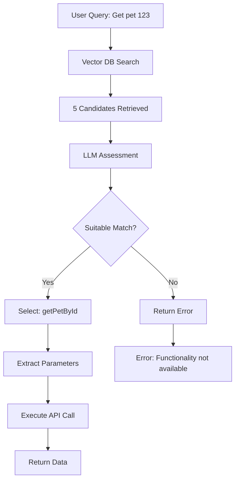

# LLM-Based Function Assessment

## Overview

The AI API Connector system uses intelligent LLM-based function assessment to ensure accurate API function selection when processing user queries. This document explains how the system evaluates multiple function candidates from the vector database and determines the best match.

## How It Works

When an external chatbot sends a query to the system:

1. **Vector Search**: The system searches the vector database and retrieves up to 5 candidate functions
2. **LLM Assessment**: An LLM evaluates each candidate to determine which (if any) best matches the user's intent
3. **Selection or Rejection**: The system either selects the best function or returns an error if no suitable match exists
4. **Execution**: If a match is found, the system executes the API call and returns the data

## Key Features

✅ **Intelligent Selection**: Uses LLM reasoning to choose the best function from multiple candidates  
✅ **Strict Evaluation**: Only selects functions that genuinely match the user's request  
✅ **Clear Error Messages**: Provides helpful feedback when requested functionality is unavailable  
✅ **Confidence Scoring**: Returns confidence levels (high/medium/low/none) with reasoning  
✅ **Fallback Logic**: Gracefully handles LLM failures with sensible defaults  

## Response Scenarios

### Scenario 1: No Functions in Database

When no connectors are configured or the vector database is empty:

```json
{
  "success": false,
  "error": "No matching connector functions found in the database. Please ensure you have uploaded and configured the necessary API connectors."
}
```

### Scenario 2: Functions Found but None Match

When functions exist but none match the user's request:

```json
{
  "success": false,
  "error": "The requested data or functionality is not available. None of the available functions provide the requested functionality."
}
```

**Example**: User asks "What's the weather today?" but only pet store APIs are configured.

### Scenario 3: Best Match Found

When a suitable function is identified:

```json
{
  "success": true,
  "data": { ... },
  "matched_function": {
    "connector": "Pet Store API",
    "operation": "getPetById",
    "path": "/pets/{petId}",
    "method": "get",
    "assessment": {
      "confidence": "high",
      "reasoning": "This function retrieves pet information by ID, which matches the user's request"
    }
  }
}
```

## Assessment Process

### 1. Candidate Preparation

The system formats each vector DB result with:
- **Operation ID**: Unique identifier for the function
- **Endpoint**: HTTP method and path
- **Description**: Semantic description from the OpenAPI spec
- **Similarity Score**: Vector distance metric

### 2. LLM Prompt

The LLM receives a structured prompt asking it to:
- Analyze the user's query
- Evaluate each candidate function
- Determine if any function genuinely matches the request
- Select the best match or indicate no suitable function exists

### 3. Evaluation Criteria

The LLM considers:
- **Semantic match**: Does the function provide what the user is asking for?
- **Operation description**: What does the function actually do?
- **Endpoint path**: Does the path structure make sense for the query?
- **HTTP method**: Is it the right type of operation (GET, POST, etc.)?

### 4. Response Format

The LLM returns a structured JSON response:

```json
{
  "selected": true,
  "index": 0,
  "reasoning": "This function retrieves pet information by ID, which matches the user's request",
  "confidence": "high"
}
```

## Configuration

The function assessment uses the same LLM configuration as parameter extraction:

- **Provider**: OpenAI, Anthropic, or Google Gemini
- **Model**: Configured in system settings (e.g., `gpt-4o`, `claude-3-5-sonnet`, `gemini-1.5-pro`)
- **API Keys**: Stored securely in the vault

Configure your LLM provider in the Settings page of the dashboard.

## Error Handling

The system includes robust error handling:

| Scenario | Behavior |
|----------|----------|
| No LLM configured | Falls back to using top vector DB result |
| LLM call fails | Uses fallback logic with low confidence |
| Invalid LLM response | Parses with error recovery |
| No candidates | Returns "no functions available" message |

## Example Flow



## Testing

To test the function assessment:

1. **Upload multiple connectors** with similar functions
2. **Send test queries** via the query endpoint
3. **Check logs** for assessment reasoning
4. **Verify responses** include confidence and reasoning

Example test queries:
- "Get pet with ID 5" → Should select `getPetById`
- "List all pets" → Should select `listPets`
- "What's the weather?" → Should return "functionality not available"

## Benefits

> **Accuracy**: LLM reasoning ensures correct function selection even with similar options  
> **User Experience**: Clear error messages when data is unavailable  
> **Transparency**: Confidence scores and reasoning provide insight into decisions  
> **Reliability**: Fallback logic ensures system continues working even if LLM fails  

## Implementation Details

### Files Modified

- **`backend/app/services/llm_service.py`**: Added `assess_function_matches()` function
- **`backend/app/api/endpoints/query.py`**: Updated to use LLM assessment

### Key Functions

```python
async def assess_function_matches(
    query: str,
    candidates: List[Dict[str, Any]]
) -> Dict[str, Any]:
    """
    Use LLM to assess which function (if any) best matches the user's query.
    
    Returns:
        - selected: bool - Whether a suitable function was found
        - index: int or None - Index of the selected candidate
        - reasoning: str - Explanation of the decision
        - confidence: str - "high", "medium", "low", or "none"
    """
```

## Logging

Enhanced logging helps debug function selection:

```
[QUERY] Found 5 candidate functions from vector DB
[QUERY] User query: Show me pet 123
[QUERY] Calling LLM to assess function matches...
[QUERY] LLM Assessment: {'selected': True, 'index': 0, 'reasoning': '...', 'confidence': 'high'}
[QUERY] Selected function: getPetById (GET /pets/{petId})
[QUERY] Confidence: high
```

## Best Practices

1. **Configure an LLM**: For best results, configure a capable LLM (GPT-4, Claude 3.5, or Gemini 1.5 Pro)
2. **Use descriptive OpenAPI specs**: Clear operation descriptions help the LLM make better decisions
3. **Monitor confidence scores**: Low confidence may indicate ambiguous queries or missing functions
4. **Review logs**: Check LLM reasoning to understand selection decisions

## Related Documentation

- [LLM Parameter Extraction](LLM_PARAMETER_EXTRACTION.md) - How parameters are extracted from queries
- [API Integration](API_INTEGRATION.md) - How to integrate with the query endpoint
- [Installation Guide](INSTALLATION.md) - Setting up the system
